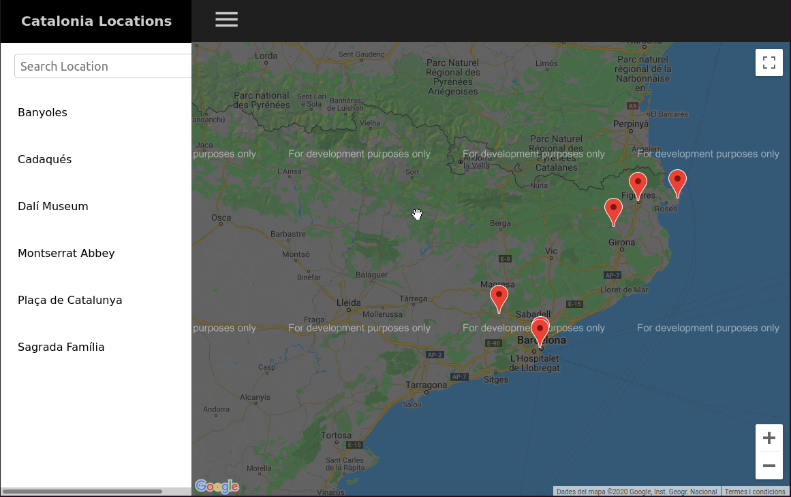
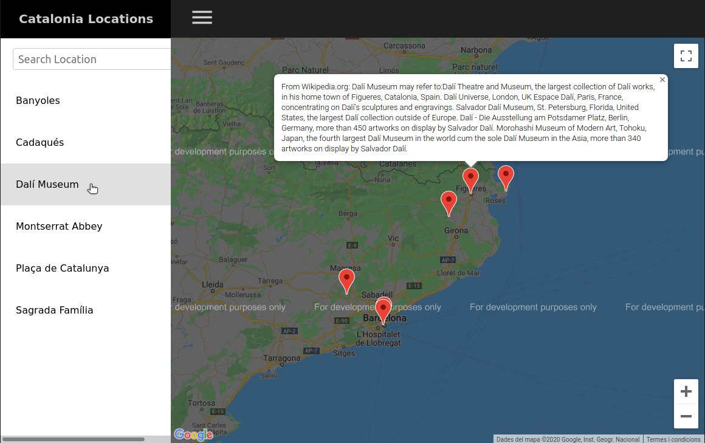
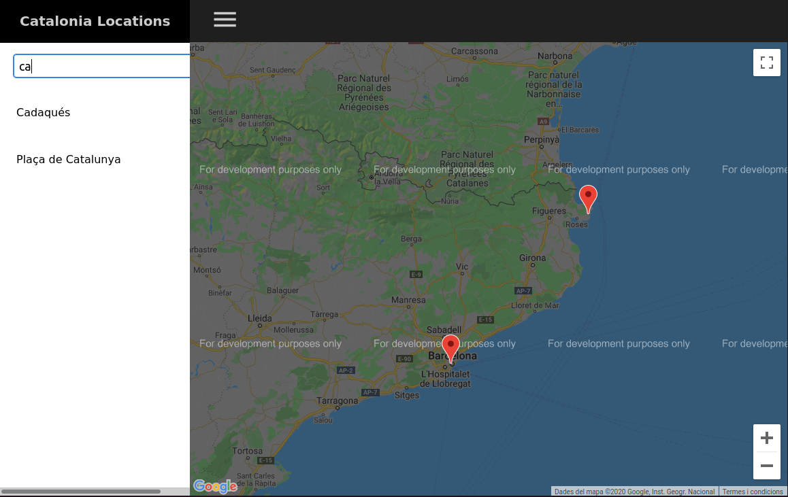

# Welcome to the Catalonia Locations app!

## Google Maps JavaScript API Key

To run the app you need to set a Google Maps JavaScript API Key on the constant `GOOGLE_MAPS_JS_API_KEY` of `src/App.js`.

## How to try the production app

`npm install` or `yarn install`

`npm start` or `yarn start`

`npm run build` or `yarn build`

`npm install -g serve` or `yarn global add serve`

`serve -s build`

This runs the app in production mode. The production app works offline with a ServiceWorker.

You can then open [http://localhost:5000](http://localhost:5000) to view it in the browser.

## How to try the development app

`npm install` or `yarn install`

`npm start` or `yarn start`

This runs the app in development mode.

You can then open [http://localhost:3000](http://localhost:3000) to view it in the browser.

## Wikipedia API

This app uses the Wikipedia API to retrieve information about the displayed locations.

## Screenshots

*Initially all the locations are shown*

*Clicking on a location on the list focuses the map on that location's marker and displays information about it from the Wikipedia API*

*You can also filter the list of locations with the search field*

Enjoy!
